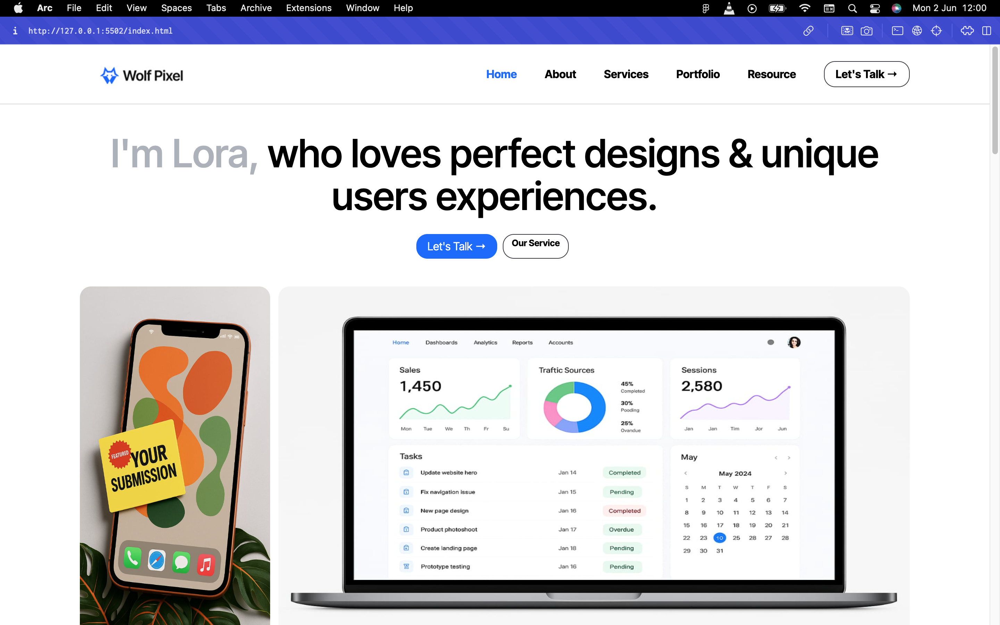
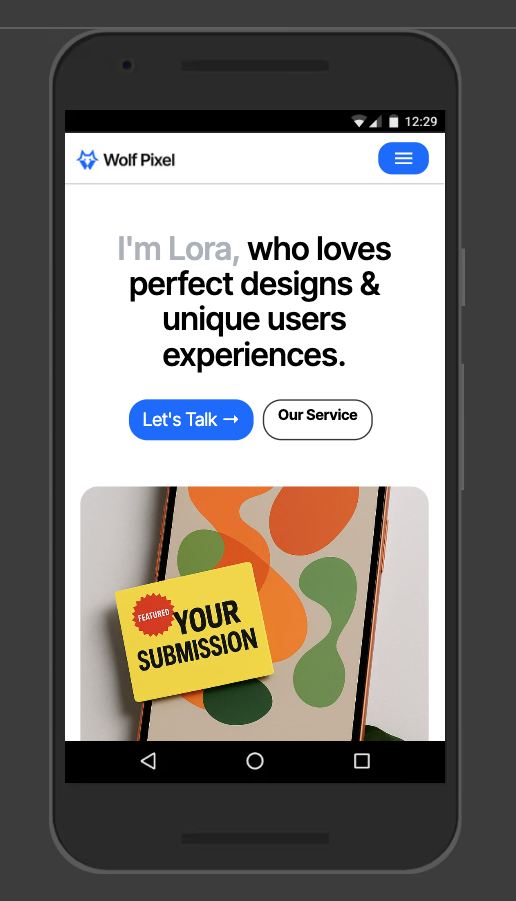

# Personal Portfolio Webpage Design

A clean, responsive portfolio webpage showcasing skills, projects, and contact info. Built from scratch with semantic HTML and CSS, this project highlights responsive design and modern UI principles.

## 📸 Screenshots

  

<!--    -->

## 🚀 Live Demo

- [Live Site](https://personal-profolio-webpage-design.vercel.app)
- [Source Code on GitHub](https://github.com/Prosper-Alex/Personal-profolio-webpage-design)

## 📚 Table of Contents

- [Overview](#overview)
- [Built With](#built-with)
- [What I Learned](#what-i-learned)
- [Author](#author)
- [License](#license)
- [Contact](#contact)

## 📝 Overview

This personal portfolio webpage is designed to provide a professional and engaging online presence. It features a responsive layout optimized for desktop, tablet, and mobile devices. The design emphasizes clarity, accessibility, and smooth user experience with interactive hover effects.

## 🛠️ Built With

- HTML5
- CSS3 (including Flexbox)
- Responsive Design Principles

## 🌱 What I Learned

- Structuring a responsive layout using Flexbox and media queries
- Applying clean, minimalistic design aesthetics
- Enhancing UX with hover effects and smooth transitions
- Organizing project files for scalability and maintainability

## 👤 Author

**Prosper Alex**  
Web Developer & Designer  
[LinkedIn](https://www.linkedin.com/in/prosper-alex) | [Twitter](https://twitter.com/prosper_alex)

## 📄 License

This project is licensed under the MIT License.

## 📬 Contact

Feel free to reach out via email: [prosperalex0110@gmail.com](mailto:prosperalex0110@gmail.com)
